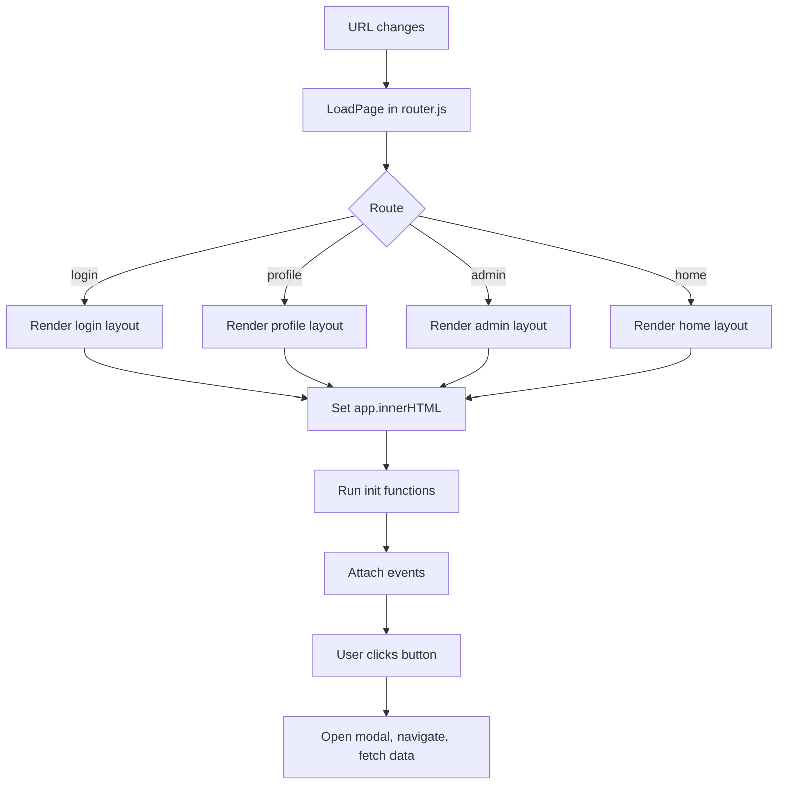

# BookStore

A minimal online bookstore demo with a Node.js + Express backend and a Vite-based frontend.

## Overview

This repository contains a full-stack example application named BookStore. The backend provides REST APIs for authentication, users, books, categories and payments. The frontend is a lightweight Vite-powered static client that consumes those APIs.

## Frontend Flow

The frontend uses a simple render-then-init pattern: the router chooses a page, the page returns markup, and a separate init function attaches event listeners after the DOM is in place.



## Tech stack

- Backend: Node.js, Express, Mongoose (MongoDB)
- Frontend: Vite, vanilla JS, Tailwind (minimal)
- Dev tooling: nodemon, Jest, Supertest

## Repository layout

- backend/ — Express API server and related code
- book_store/ — Vite frontend application (static client)

## Quick start

Prerequisites:

- Node.js (v18+ recommended)
- npm
- MongoDB (local or remote)

1) Backend

Install dependencies and start the API server:

```bash
cd backend
npm install
# development with auto-reload
npm run dev
# or start production-like server
npm run run
```

Server defaults to port `9000` unless `PORT` is set.

2) Frontend

Install and run the Vite dev server:

```bash
cd book_store
npm install
npm run dev
```

The frontend runs via Vite and will proxy or call your backend API endpoints as configured in the client code.

## Environment variables (backend)

Place environment variables in one of these locations (the project checks them in order):

- `backend/envs/.env.local` (development)
- `backend/envs/.env.prod` (production)
- `backend/.env`

Common variables used by the project:

- `DB_URI` / `DB_URL` — full MongoDB connection URI (overrides host/name)
- `HOST` — MongoDB host (default: localhost)
- `DB_NAME` — Database name (default: BookStore)
- `PORT` — API server port (default: 9000)
- `JW_SECRET` / `JWT_SECRET` — JWT signing secret
- `JW_EXPIRES_IN` / `JWT_EXPIRES_IN` — JWT expiration (e.g. 1d)

## Useful scripts

- Backend
  - `npm run dev` — start `nodemon` development server
  - `npm run run` — start node server
  - `npm test` — run tests (Jest)
- Frontend (book_store)
  - `npm run dev` — start Vite dev server
  - `npm run build` — build for production
  - `npm run preview` — preview build

## Create default admin user

The backend includes a convenience script to create a default admin user:

```bash
cd backend
node src/scripts/createAdmin.js
```

This script creates an admin with username `admin` and a default password (see script). Use it only for local development.

## Testing

Backend tests use Jest + Supertest. From the `backend` folder run:

```bash
npm test
```

## Contributing

Contributions are welcome. Open an issue to propose changes or submit a pull request with a clear description of your changes and rationale.

## License

This project is provided under the `ISC` license (see LICENSE file).

---

If you'd like, I can also:

- add a short API reference section with common endpoints,
- add example `.env.local` template in `backend/envs/.env.local.example`, or
- create a short CONTRIBUTING.md with contribution guidelines.
